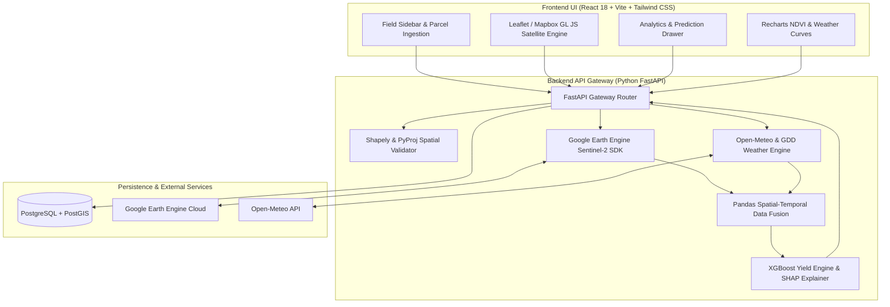

# GeoCrop AI: Crop Yield Prediction Platform
### Fusing Satellite Imagery & Weather Data with Spatial AI

**GeoCrop AI** is an enterprise-grade Spatial AI platform designed for high-resolution crop yield estimation, temporal canopy health tracking, and agronomic explainability. By fusing **Sentinel-2 multispectral satellite imagery** with **Open-Meteo & ERA5 meteorology datasets**, the platform predicts crop yield rates in tons per hectare (`t/ha`), calculates 95% statistical confidence intervals, and explains top drivers using **SHAP (SHapley Additive exPlanations)**.

---

## 🏗️ System Architecture



---

## 🛠️ Tech Stack & Engineering Highlights

- **Backend**: Python 3.9+, FastAPI, GeoPandas, Shapely 2.0, PyProj, Xarray, Google Earth Engine Python API (`earthengine-api`), XGBoost, Scikit-Learn, SHAP, SQLAlchemy 2.0, GeoAlchemy2, Pytest.
- **Frontend**: React 18, Vite, Tailwind CSS, Recharts, Leaflet (Zero-Token Esri Satellite Layer), Mapbox GL JS & `@mapbox/mapbox-gl-draw`, Lucide Icons, Axios.
- **Spatial Storage**: PostgreSQL 15+ with PostGIS 3.3 extension (Geometry indexing & spatial queries).

---

## ⚙️ Environment Variables

### Backend Configuration (`backend/.env`)
Create a `.env` file in the `backend/` directory:

```env
# General
PROJECT_NAME="GeoCrop AI - Yield Prediction API"
VERSION="1.0.0"
API_V1_STR="/api/v1"
TESTING=False

# PostGIS Database Connection
POSTGRES_SERVER=localhost
POSTGRES_USER=postgres
POSTGRES_PASSWORD=postgres
POSTGRES_DB=geocrop_db
POSTGRES_PORT=5432

# Optional Google Earth Engine Credentials
GEE_SERVICE_ACCOUNT="geocrop-sa@your-project.iam.gserviceaccount.com"
GEE_PRIVATE_KEY_PATH="/path/to/gee-private-key.json"
```

### Frontend Configuration (`frontend/.env`)
Create a `.env` file in the `frontend/` directory:

```env
VITE_API_BASE_URL="http://localhost:8000/api/v1"

# Optional Mapbox Access Token (Leaves map on free high-res Esri Satellite layer if omitted)
VITE_MAPBOX_TOKEN=""
```

---

## 🚀 Step-by-Step Setup Guide

### 1. Spatial Database (PostgreSQL + PostGIS)
Start the PostGIS spatial container using Docker Compose:
```bash
docker-compose up -d
```
*Note: If running without Docker, set `TESTING=True` when starting FastAPI to use SQLite fallback mode.*

---

### 2. Backend Setup & Pytest Execution
Navigate to the `backend/` folder, set up the virtual environment, install dependencies, and execute the test suite:

```bash
cd backend

# Create & activate virtual environment
python3 -m venv venv
source venv/bin/activate

# Install requirements
pip install -r requirements.txt

# Execute End-to-End Pytest Suite
PYTHONPATH=. ./venv/bin/pytest tests/

# Launch FastAPI Dev Server
uvicorn app.main:app --reload --port 8000
```
- **API Base URL**: `http://localhost:8000`
- **Interactive Swagger Documentation**: `http://localhost:8000/docs`
- **Health Endpoint**: `http://localhost:8000/api/v1/health`

---

### 3. Frontend Setup & Build Verification
In a separate terminal, navigate to the `frontend/` directory:

```bash
cd frontend

# Install Node dependencies
npm install

# Verify production build compilation
npm run build

# Start Vite Development Server
npm run dev
```
- **Web Application Dashboard**: `http://localhost:5173`

### 4. Expo Mobile App Setup (React Native)
Navigate to the `mobile/` directory to launch the Expo cross-platform mobile application:

```bash
cd mobile

# Install dependencies
npm install

# Start Expo Development Server
npx expo start
```
- **Android Emulator**: `npm run android`
- **iOS Simulator**: `npm run ios`
- **Expo Go App**: Scan the terminal QR code with your mobile camera or Expo Go app.

---

## 📡 REST API Reference


| Method | Endpoint | Description |
| :--- | :--- | :--- |
| `GET` | `/api/v1/health` | System health check & geospatial engine status |
| `POST` | `/api/fields` | Ingests field boundary polygon, validates geometry, calculates area (`ha`) |
| `GET` | `/api/fields` | Retrieves saved field parcels (`?format=geojson` for FeatureCollection) |
| `GET` | `/api/fields/{id}` | Retrieves single field details |
| `DELETE` | `/api/fields/{id}` | Deletes a field boundary |
| `GET` | `/api/fields/{id}/analytics` | Returns Sentinel-2 satellite indices (NDVI/NDWI) fused with Open-Meteo weather & GDD |
| `GET` | `/api/fields/{id}/yield-prediction` | Executes XGBoost yield inference (`t/ha`), 95% Confidence Interval & SHAP drivers |

---

## 🧪 End-to-End Verification Results

- **Backend Pytest Suite**: `11 passed in 1.83s`
- **Frontend Vite Build**: `built in 5.01s` (2,418 modules transformed with 0 errors).
